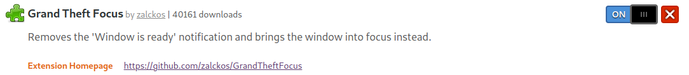

# automating my daily life

## how to use it:
1. press `ctrl + alt + q` to translate the selected text. (english to spanish or vice versa)
2. press `ctrl + alt + g` to check the selected text grammar.
3. press `ctrl + alt + s` to search the selected text in google.
4. press `ctrl + alt + d` to look up the selected text in the dictionary.
5. press `ctrl + alt + a` to look up the selected text in the thesaurus. (synonyms and antonyms)

## how to install it:
1. first let's install some dependencies:
```bash
sudo apt-get update
sudo apt-get install python3-gi python3-gi-cairo gir1.2-gtk-3.0 gir1.2-keybinder-3.0 libcairo2-dev libxt-dev libgirepository1.0-dev
```
2. as we'll have a window pop up every time we call a functionality, we need to install the following dependency:
```bash
sudo apt-get update
sudo apt-get upgrade
sudo apt install gnome-shell-extension-manager
```
3. then go to this link: https://extensions.gnome.org/extension/5410/grand-theft-focus/ (gnome extensions website) and just turn it on.


4. install the required python packages:
```bash
cd path_to_root_folder
pip install -r requirements.txt
```

5. create .env file with openai api and deepl api keys:
```bash
echo "OPENAI_API_KEY='your_api_key'" > .env
echo "DEEPL_API_KEY='your_api_key'" >> .env
echo "MERRIAM_WEBSTER_API_KEY='your_api_key'" >> .env
```

6. finally we can run the script:
```bash
python3 main.py
```
